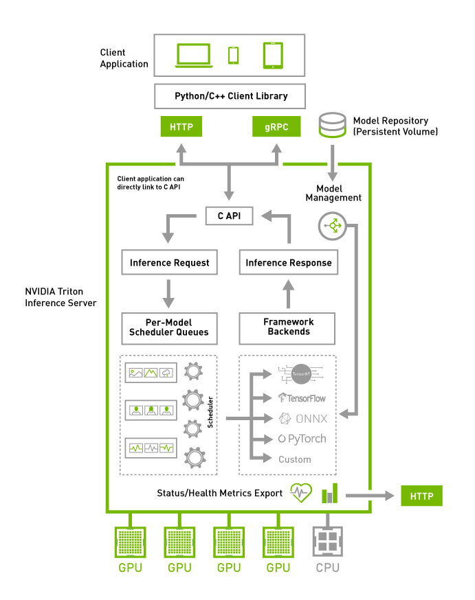

# Triton inference Server
O Triton inference server, ou tambem conhecido como NVIDIA Dynamo, e uma ferramenta open source que padroniza e otimiza a implantacao de modelos de IA em escala em ambiente de producao. Ele atua como um servidor de inferencia que permite que aplicacoes se comuniquem com modelos de Machine Learning e gere resultados de forma eficiente.

<p align="center">
  
</p>


## Iniciando o projeto
Para iniciar o projeto rapidamente, devemos configurar o ambiente e instalar todas as dependencias.

Neste ponto, voce pode utilizar a ferramenta que preferir: conda, mamba, miniconda .venv um proprio container docker ou qualquer outra ferramenta de sua preferencia para que seja possivel ter um ambiente limpo livre de conflitos e instalacoes de versoes previas de qualquer outra bibliteca.

Para este projeto em especifico eu irei utilizar o `uv`, o uv e uma excelente ferramenta para gerenciar projetos e ambientes desenvolvindo pela **Astral** em **Rust** caso voce ja tenha o `uv` instalado em sua maquina siga para o proximo topico.

Caso voce nao tenha o uv em sua maquina podemos realizar a instalacao executando:

```bash
curl -LsSf https://astral.sh/uv/install.sh | sh
```
Vamos conferir se a instalacao foi feita com sucesso:

```bash
uv -V
```
Agora, clone o repositorio:

```bash
 git clone https://github.com/joaomedeirosr/nvidia-triton.git
```
## Configurando o ambiente
Com o projeto, vamos configurar o ambiente, vamos simplesmente executar o seguinte e tudo sera configurado automaticamente e pronto para o uso, veja:

```bash
uv sync
```

Caso voce queira iniciar o projeto e configurar tudo manualmente faca o seguinte:

```bash
uv init --bare --python<3.x.x> --verbose
```
Com isso voce tera o inicio, de um pyproject.toml, limpo, agora vou executar:

```bash
# Para inicializar o .venv e seu projeto
uv sync
```
Agora, podemos adicionar manualmente cada uma das dependencias do projeto

```bash
uv add torch torchvision numpy "tritonclient[http]"
```
Legal, agora ja temos o ambiente pronto e podemos comecar

### 

## Iniciando o servidor backend Triton inference server:

Para iniciar o servidor backend, devemos executar a imagem que construimos e que colocamos o nome de `custom-triton`. Esta docker image, sera responsavel por fazer todo o processo de construcao do backend do nosso triton inference server.

Antes de inicializar esta imagem, precisamos nos lembrar de alguns pontos: 

 - **Expor portas do container**: para o end point atraves do -p, informando a porta que sera disponiabilizada internamente no container e a porta que iremos utilizar para fazers os requests ("endpoints")lembrando que as portas **{8000,8001,8002}** sao respectivamente: **{HTTP,gRPC, metrics}**
 - **Bind Mount**: utilizar o -v para mapear a pasta do projeto para dentro do container

```docker
     docker run --rm \                  
     -p 8000:8000 \
     -p 8001:8001 \
     -p 8002:8002 \
     -v /home/joao/triton/models:/models \
     custom-triton \
     tritonserver --model-repository=/models
```
Feito isso o `Server` (backend) sera iniciado, e ficara aguardando por requisicoes que serao enviadas pelo `Client`.

O `Client` pode ser construido de diversas maneiras, e isso vai depender das particularidades do que esta se tentando construir. Em outras palavras o client ira depender da arquitetura do seu projeto.

Entretanto, vamos realizar a implementacao do inference client do projeto em especifico implementado de duas maneiras diferentes, sendo estas utilizando a propria library `tritonclient`, quando o `requests` do Python que servirao como otima inspiracao para implementacao de clientes de inferencia completamente diferentes.

Os inference clientes estao em:
```bash
./triton/torch/inference_triton_client_lib.py
```
Sendo assim, iniciado o server com o custom-container image devemos executar o script `inference_triton_client_lib.py` para que seja possivel realizar a inferencia.